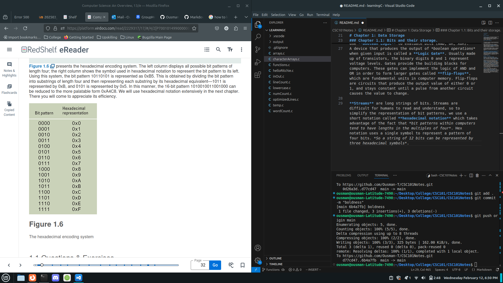

# CSC 101 Notes

# Chapter 0

### 0.0 Introduction
___

**Computer Science** is the discipline that seeks to build a scientific foundation for such topics as computer design, programming, info processing, algorithmic solutions, and the process itself. It provides a backbone for today's computer applications as well as for tomorrow's infrastructure.

### 0.1 The Role of Algorithms
___

+ An algorithm is simply a set of steps that define how a task should be completed. For example a cooking recipe is an algorithm technically.

Before a machine can perform a task, an algorithm for handling said task must be utilized in a language the computer can understand. **Programming/Coding** is the act of developing a program and encoding it in the language a computer can understand. Programs and the algorithms they represent are referred to as software.

The study of algorithms began as a subject of mathematics, which held benefits long before computers were invented. The goal was to find a single set of directions that described how all problems of a specific type can be solved.

**Once an algorithm for performing a task has been found, the performance of the task no longer requires an understanding of the foundations of said algorithm.** Using algorithms as a means of conveying intelligence to machines has become useful in allowing them to perform useful tasks. By that metric, ** the level of intelligence of a machine is limited to the capabilities of the algorithm deployed.

# Chapter 1: Data Storage
___
### Chapter 1.1: Bits and their storage.
All data at it's lowest level is stored in encoded patterns of 0's and 1's, called **Bits(short for Binary Digit)**. They're used to represent many different forms of data, from numerics to sentences to images to sounds.

With the use of 0's and 1's to represent data, 0's represent false and 1 represents true. This is **Boolean Operations**. These bits can be combined, evaluated, operated on, and manipulated in many different ways. We use **Boolean Logic** to evaluate bits (AND, OR, XOR).
A device that produces the output of *boolean operations* when given input is called a **Logic Gate**. Usually made up of transistors, the binary digits 0 and 1 represent voltage levels. Gates provide the building blocks for computers. These gates can implement the logic of AND and OR in order to form larger gates called **flip-flops**, which are fundamental units in computer memory. Flip-flops are circuits that produce the output value of either 0 or 1, and stays constant until a pulse from another circuit causes the value to change.

**Streams** are long strings of bits. Streams are difficult for humans to read and understand, so to simplify the representation of bit patterns, we use a short notation called **hexadecimal notation** which takes advantage of the fact that *bit patterns within computers tend to have lengths in the multiples of four*. Hex notation uses a single symbol to represent a pattern of four bits. *So a string of 12 bits can be represented by three hexadecimal symbols*.
The image below represents the hexadecimal encoding system. The left column displays bit patterns in the lenth of four, while the right column shows the symbol used in hex notation to represent the bit pattern to the left. *This is done by dividing the left bit pattern into substrings of four, then representing each substring by it's hex equivalent. So 1011 is represented by 0xB.

___
### 1.2: Main Memory
+ Computers contain large collections of flip-flop like circuits that are capable of storing a single bit each. This *reservoir* of bits is known as the machine's **Main Memory**. The computer's main memory is organized in units called cells. Each cell typically stores 8 bits, **8 bits = 1 byte**. *Theoretically* bits within memory are stored from left to right. The leftmost bit is called the **most significant bit** due to the fact that it represents the most significant numeric value of a number (if 237 is stored in memory, the first bit would represent the two hundred).

To locate cells that store specific value, we utilize **memory addressess**. With the use of memory addressess, we can then implement *read operations* (locating specific data based on their address). Or *write operations* (saving bit patterns/data into emptry memory cells). This also allows computers to access memory/data without relying on sequence hence **Random Access Memory or RAM**.